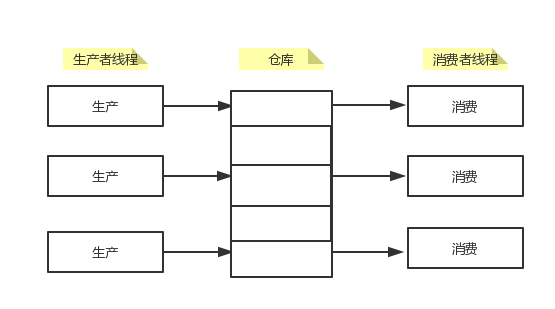
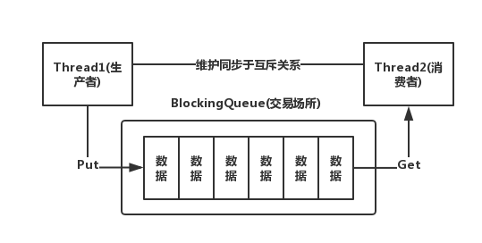
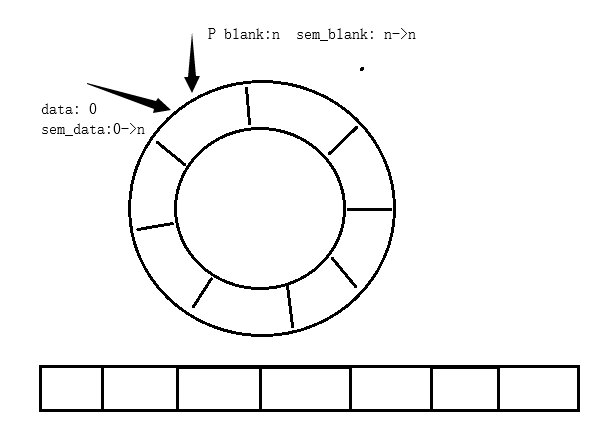

### 互斥量实现原理

**加锁过程**：申请锁在一条指令中执行，在汇编指令中当一个线程要拿到会互斥锁会先将寄存器中的值与内存中的值进行交换(swap)，因为只有一条指令所以是原子性的，

```
lock:
	movb $0,%al
	xchgb %al,mutex
	if(al寄存器的内容 > 0){
        return 0;
	}else 挂起等待；
	goto lock;
unlock:
	movb $1,mutex
	唤醒等待Mutex的线程；
	return 0；
```

- 汇编加锁过程：先将0存放进al寄存器中，然后将mutex锁与寄存器exhange，如果锁没有被使用那么al值就为1，当al大于0就表示申请锁成功。
  - 寄存器为当前上下文，当线程在申请锁的时候如果被切换出去时，就要进行上下文保护，然后将新线程的寄存器放到CPU中申请锁，线程间不会有风险，在exchange切换也没有问题，由于exchange是一条语句要么执行，要么不执行。当执行成功后，旧线程在被切换时是拿着锁走的，新线程只能挂起等待。
- 解锁过程：指需要将1与mutex交换，重新将锁设置为1，代表锁资源被释放，其他线程就可以重新进行竞争。

### 可重入与线程安全

线程安全：一个线程出问题而导致其他线程跟着出问题 

可重入和线程安全之间的联系

- 函数可重入的，那就是线程安全的‘

- 函数不可重入，那就不能由多个线程使用，有可能引发线程安全问题

- 如果一个函数中有全局变量，那么这个函数既不是线程安全也不是可重入的可重入和线程安全的区别

- 可重入函数是线程安全函数的一种

- 线程安全不一定是可重入的，而可重入函数则一定是线程安全的

- 如果将对临界资源的访问加上锁，则这个函数是线程安全的，但如果这个重入函数若锁还未释放则会产生死锁，因此是不可重入的

  

  可重入函数的就是线程安全的，**不可重入就有可能不是线程安全的，线程安全的不一定函数可重入的** 

### 死锁产生的必要条件（缺一不可）

**死锁：线程一直不会释放锁资源，其余线程处于永久等待状态** 

- 互斥条件：一个资源每次只能被一个执行流使用
- 请求与保持条件：一个执行流因请求资源而阻塞时，对已获得的资源保持不放
- 不剥夺条件：一个执行流已获得的资源，在未使用完之前，不能强行剥夺
- 循环等待条件：若干执行流之间形成一种头尾相接的循环等待资源的关系

**避免死锁破坏死锁的四个必要条件**

- 破坏死锁的四个必要条件至少一个

- 加锁顺序一致（都按照一定的顺序申请锁）
- 避免锁未释放的场景
- 资源一次性分配 

**避免死锁算法（了解**）

- 死锁检测算法（了解）
- 银行家算法（了解） 

### Linux线程同步

**线程互斥 是为了保护线程的安全性和可靠性**

**线程同步 是为了解决多线程协同之间的不合理问题，更多的是为了解决饥饿问题** **，在保证临界资源安全的前提下，让两个或多个执行流在访问临界资源时具有一定的顺序性**

- 例如在生产消费者模型中，当生产者生产产品，消费者等待消费，为了避免生产者一直生产而导致消费者不能及时的获取到锁资源而进行消费，就引入条件变量来解决问题，当生产者生产完商品后就马上一个提示信息来提示消费者消费，这种现象就称作同步机制，而这里的提示信息就是条件变量。

#### 条件变量：用来实现同步

- 当一个线程互斥地访问某个变量时，它可能发现在其它线程改变状态之前，它什么也做
- 例如一个线程访问队列时，发现队列为空，它只能等待，只到其它线程将一个节点添加到队列中。这种情况就需要用到条件变量。

提供了一个等待队列，可以让我们的执行流可以在某个条件下进行等待，因此条件变量会提供两个重要的方法，一个是在条件变量下等待，另一个是通知在条件变量下等的线程。

**等待条件满足**

- ```c
  int pthread_cond_wait(pthread_cond_t *restrict cond,pthread_mutex_t *restrict mutex);
  参数：cond：要在当前条件变量下进行等待
  	 mutex：互斥量
  功能：1.释放锁资源
  	 2.在条件变量下进行等待
  ```

**唤醒等待**

- ```c
  int pthread_cond_broadcast(pthread_cond_t *cond);  通知在条件变量下等待的所有线程
  int pthread_cond_singal(pthread_cond_t *cond);  通知在条件变量下等待的一个线程
  ```


**等待需要互斥量**：因为要在条件变量下等待必须将锁释放掉才可以去等待，当前临界资源不满足你所需要的条件，

- 拿锁查看临界资源->解锁等待->拿锁->.....
- 解锁与等待都是原子操作

38_11_25 上0

#### 生产者消费者模型



##### 特点：

- 解耦
- 支持并发
- **支持忙闲不均**

> **321原则：**3个关系，2种角色（客户与厂商），一个交易场所（操作系统所提供的一段内存资源：超市）

- 消费者之间是互斥关系（比如有两个消费者一个商品）
- 生产者之间是互斥关系
- 生产者与消费者为互斥与同步关系 

**同步使用条件变量解决，互斥用互斥锁**



**阻塞队列（BlockQueue）：**就是用来给生产者和消费者解耦的，可以理解成仓库一样。


### POSIX信号量

**本质上是一个计数器，用来描述临界资源的数目，用来保护临界资源，本身也是临界资源。当申请到信号量，那么里边的资源就可以获取得到。**

##### 信号量操作：

- 初始化信号量

  ```c
  #include <semaphore.h>
  int sem_init(sem_t *sem, int pshared, unsigned int value);
  参数：
  	pshared:0表示线程间共享，非零表示进程间共享
  	value：信号量初始值
  信号量是线程间共享的
  ```

- 销毁信号量

  ```c
  int sem_destory(sem_t *sem);
  ```

- 等待信号量 （P操作，原子操作）

  ```c
  int sem_wait(sem_t *sem);
  功能：等待信号量，当信号量申请成功时将信号量值减1
  ```

- 发布信号量 （V操作，原子操作）

  ```c
  int sem_post(sem_t *sem);
  功能：发布信号量，当资源使用完毕，归还资源后将信号量值加1
  ```

#### 基于唤醒队列的生产消费模型

##### 实现流程

- 环形队列采用数组模拟，用模运算来模拟环状特性
- 环形结构起始状态和结束状态都是一样的，不好判断为空或者为满，所以可以通过加计数器或者标记位来判断满或者空。另外也可以预留一个空的位置，作为满的状态
- 通过信号量这个计数器进行简单多线程间的同步过程

##### **用信号量完成无锁同步的过程**：

- 消费者不能超过生产者
- 生产者不能将消费者套圈
- 生产者和消费者指向同一个位置时，要保证有且只有一个线程执行。

 

- 二元信号量来实现同步

**生产者所关心的是环形对列中的所剩余空格区域，而消费者关心的则是生产者锁生产的数据。**

**当在初始时，生产者与消费者指向同一块区域，同时申请各自的信号量，由于生产者的数据信号量初始值为0，而消费者的空格初始信号量为n，所以在初始时生产者一定先申请到空格信号量。消费者只有在生产者申请完信号量后才申请到信号量，所以消费者一定是在生产者后面执行的，通过生产者来控制数据信号量。生产者将空格信号量全部申请完之后就只能挂起等待消费者，消费者与生产者之间相互牵制。**


#### 读写锁

**读写锁本质是自旋锁**

> **321**原则

​							              **读写锁的行为**

| 当前锁状态 | 读锁请求 | 写锁请求 |
| ---------- | -------- | -------- |
| 无锁       | 可以     | 可以     |
| 读锁       | 可以     | 阻塞     |
| 写锁       | 阻塞     | 阻塞     |

- 写独占，读共享，写锁优先级高
- 当发现目标线程在临界资源中待的时间特别久时，应该采用的锁为挂起等待锁。当发现目标线程在临界资源中待时间特别短时，而采用自旋锁，自旋是一个非常消耗CPU资源的过程。

**java_Linux_8_15_上**：大复习

线程概念，线程与进程的区别，线程大部分资源共享，哪些又是私有的呢，线程控制，怎么创建，怎么终止，怎么等待，怎么分离，同步与互斥，两种模型


